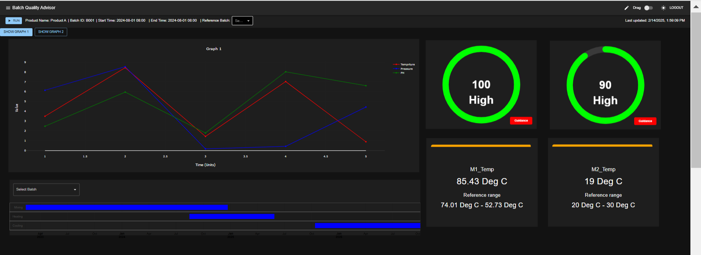
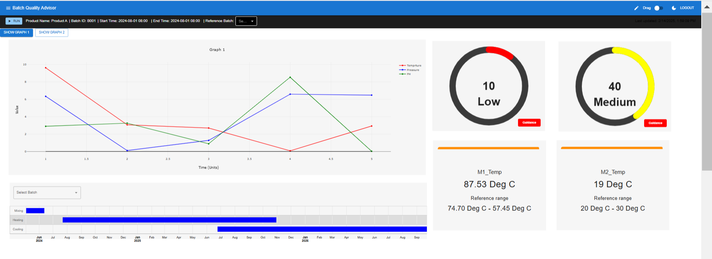

# Batch Quality Dashboard

A **React.js-based Batch Quality Analytics Dashboard** designed to monitor and visualize key performance indicators (KPIs) for batch quality analysis. The dashboard provides **real-time insights**, interactive visualizations, and customizable filters to track batch performance efficiently.

---

## Key Features

**Real-time Batch Monitoring** – Track live batch status and quality metrics  
 **Interactive Visualizations** – Graphs and charts powered by Plotly & Google Charts  
 **Customizable Filters** – Filter data by product name, batch ID, and time range  
 **Modern UI** – Built with Material-UI for a clean and responsive design  
 **Scalable & Maintainable** – Modular React components for better code structure  
 **Dark & Light Mode Support** – User-friendly UI with theme switching

---

## UI Screenshots

### Login Screen

The user authentication page where users can log in securely.  


### Batches Table – Current & Historical Batches

Displays current and past batches with key batch details.  


### Dashboard View (Dark Mode)

The main analytics dashboard in dark mode, providing real-time insights.  


### Dashboard View (Light Mode)

The same analytics dashboard but in light mode for better visibility in bright environments.  


---

## Dark & Light Mode Support

The dashboard supports **both Dark Mode and Light Mode**, allowing users to switch based on their preference.
_The theme setting is managed using Material-UI's ThemeProvider and stored for user convenience._

---

## Tech Stack

- **Frontend:** React.js, Material-UI, Plotly, Google Charts
- **Backend Integration:** API calls handled via Axios / Fetch
- **Styling:** CSS, Material-UI

---

## Getting Started

This project was bootstrapped with [Create React App](https://github.com/facebook/create-react-app).

### **Installation & Setup**

Clone the repository and install dependencies:

```sh
git clone https://github.com/your-username/repo-name.git
cd repo-name
npm install
```
